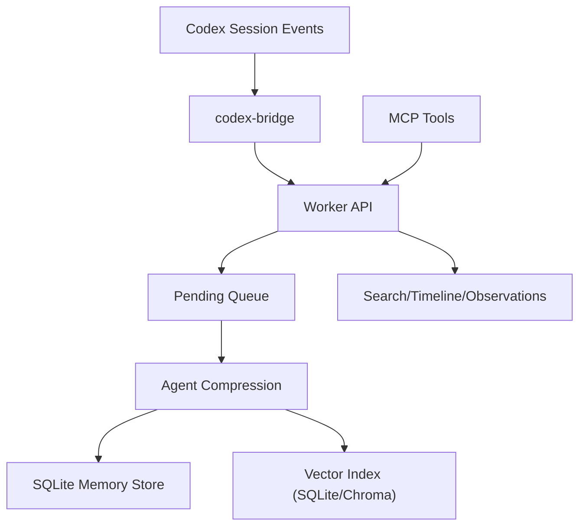

# CodexMem

[](./LICENSE)
[](https://bun.sh)
[](https://www.typescriptlang.org)
[](https://modelcontextprotocol.io)

Chinese documentation: [`README_ZH.md`](./README_ZH.md)

CodexMem is a persistent memory service for Codex/MCP workflows. It captures high-signal session events, processes them asynchronously, and stores structured memories that can be reused across sessions.

## Why CodexMem

- Fully automatic background memory after MCP connection in Codex App.
- ClaudeMem-aligned lifecycle semantics.
- Production-oriented queueing, dedupe, observability, and release gates.
- Project-level retention policy with safe cleanup (soft delete + delayed hard delete).

## Feature Highlights

- Memory lifecycle: `session-init -> observation -> summarize -> session-end(cleanup)`.
- Hook adapters: `claude-code`, `cursor`, `codex`, `raw`.
- MCP tools: `__IMPORTANT`, `search`, `timeline`, `get_observations`, `save_memory`.
- Vector modes: `sqlite`, `chroma`, `hybrid`.
- Queue reliability: pending/processing/failed state machine + persistent dedupe keys.
- Ops observability: SSE stream, viewer dashboard, traces, failure stats, trend exports.
- Retention TTL: default 30 days inactive -> soft delete, hard delete after grace period.

## Architecture



Key modules:
- `src/worker/server.ts`: Worker API and queue processing core.
- `src/mcp/server.ts`: MCP stdio server.
- `src/cli/codex-bridge.ts`: Codex session log bridge.
- `src/db/store.ts`: SQLite storage (sessions, observations, summaries, queue, vectors, retention).

## Quick Start

### 1) Install

```bash
cd /Users/zzz/fun/mem/codexmem
bun install
```

### 2) Run (recommended)

```bash
bun run mcp
```

`bun run mcp` auto-checks Worker health, auto-starts Worker when needed, then auto-starts `codex-bridge` for background memory.

### 3) Codex App MCP config

File: `/Users/zzz/.codex/config.toml`

```toml
[mcp_servers.codexmem]
command = "zsh"
args = [ "-lc", "cd /Users/zzz/fun/mem/codexmem && bun run mcp" ]
```

## Commands

- Start worker: `bun run worker`
- Start MCP: `bun run mcp`
- Start bridge only: `bun run codex:auto-memory`
- Type check: `bun run check`
- All tests: `bun test`

## Configuration

Config file: `~/.codexmem/settings.json`

Core:
- `CODEXMEM_WORKER_HOST`, `CODEXMEM_WORKER_PORT`
- `CODEXMEM_MCP_ENABLED`
- `CODEXMEM_PROVIDER`

Model (OpenAI-compatible):
- `CODEXMEM_OPENAI_MODEL`
- `CODEXMEM_OPENAI_EMBEDDING_MODEL`
- `CODEXMEM_OPENAI_BASE_URL`, `CODEXMEM_OPENAI_API_KEY`
- `CODEXMEM_OPENAI_EMBEDDING_BASE_URL`, `CODEXMEM_OPENAI_EMBEDDING_API_KEY`

Vector:
- `CODEXMEM_VECTOR_BACKEND=sqlite|chroma|hybrid`
- `CODEXMEM_CHROMA_URL`, `CODEXMEM_CHROMA_COLLECTION`

Reliability:
- `CODEXMEM_SKIP_TOOLS` (default: `ListMcpResourcesTool,SlashCommand,Skill,TodoWrite,AskUserQuestion`)
- `CODEXMEM_STALE_PROCESSING_MS`
- `CODEXMEM_AUTO_RECOVER_ON_BOOT=false`

MCP auto-bootstrap env flags:
- `CODEXMEM_MCP_AUTO_BOOTSTRAP=false`
- `CODEXMEM_MCP_AUTO_BRIDGE=false`
- `CODEXMEM_MCP_STOP_WORKER_ON_EXIT=true`

Retention TTL:
- `CODEXMEM_RETENTION_ENABLED=true`
- `CODEXMEM_RETENTION_TTL_DAYS=30`
- `CODEXMEM_RETENTION_SOFT_DELETE_DAYS=7`
- `CODEXMEM_RETENTION_SWEEP_INTERVAL_MIN=1440`

## API Overview

Health:
- `GET /api/health`
- `GET /api/readiness`
- `GET /api/version`

Session and memory:
- `POST /api/sessions/init`
- `POST /api/sessions/observations`
- `POST /api/sessions/summarize`
- `POST /api/sessions/end`
- `POST /api/memory/save`

Query:
- `GET /api/search`
- `GET /api/timeline`
- `GET /api/context/inject`
- `GET /api/observations`
- `GET /api/summaries`
- `GET /api/prompts`
- `GET /api/observation/:id`
- `POST /api/observations/batch`

Ops and retention:
- `GET /api/events`
- `GET /viewer`
- `GET /api/ops/index-status`
- `POST /api/ops/retry-failed`
- `POST /api/ops/backfill/chroma`
- `POST /api/pending-queue/process`
- `GET /api/ops/retention/policies`
- `POST /api/ops/retention/policies`
- `POST /api/ops/retention/cleanup`

## Testing and Gates

- Contract: `bun test tests/contract.test.ts`
- Hook matrix: `bun run test:hook-matrix`
- MCP E2E: `bun run test:mcp-e2e`
- Full suite: `bun test`

Release quality gates:
- `bun run test:parity`
- `bun run test:benchmark`
- `bun run test:soak`
- `bun run test:release-gate`

## Troubleshooting

- MCP connected but no memory:
  - Check `GET /api/health`
  - Verify `codex-bridge` process is alive
  - Ensure tool/idle-end events actually happen
- Unexpected memory reduction:
  - Inspect retention settings and cleanup calls
  - Use cleanup `dry-run` first
- Weak search quality:
  - Verify vector backend mode
  - Verify embedding/chroma connectivity

## Docs

- `docs/project-docs-consolidated.md`
- `docs/api-contract.md`
- `docs/data-schema.md`
- `docs/session-state-machine.md`
- `docs/compatibility-matrix.md`
- `docs/implementation-status.md`
- `docs/codex-auto-memory.md`
- `docs/p5-release-gate.md`
- `docs/t2-baseline-convergence.md`
- `docs/t4-release-workflow.md`
- `docs/claudemem-live-parity.md`

## License

This project is licensed under the **MIT License**. See [`LICENSE`](./LICENSE).
